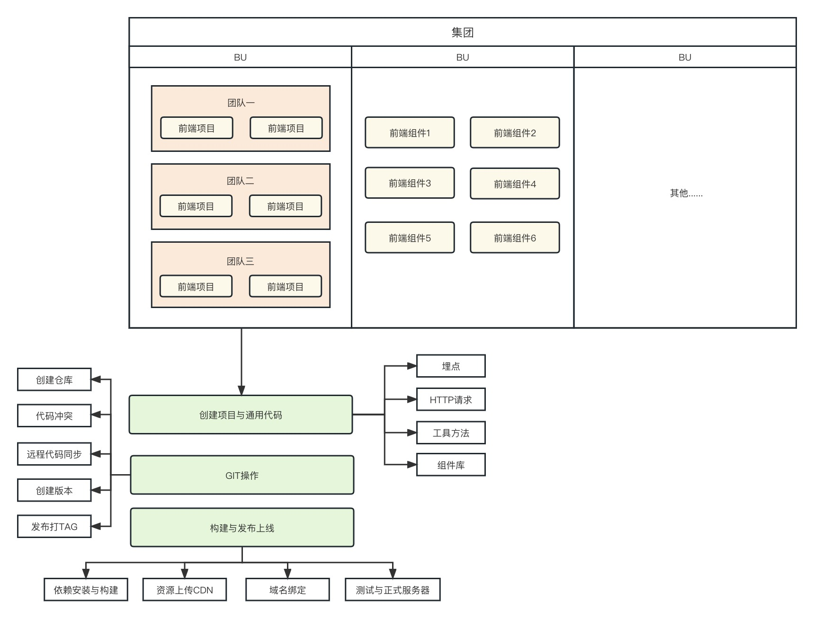
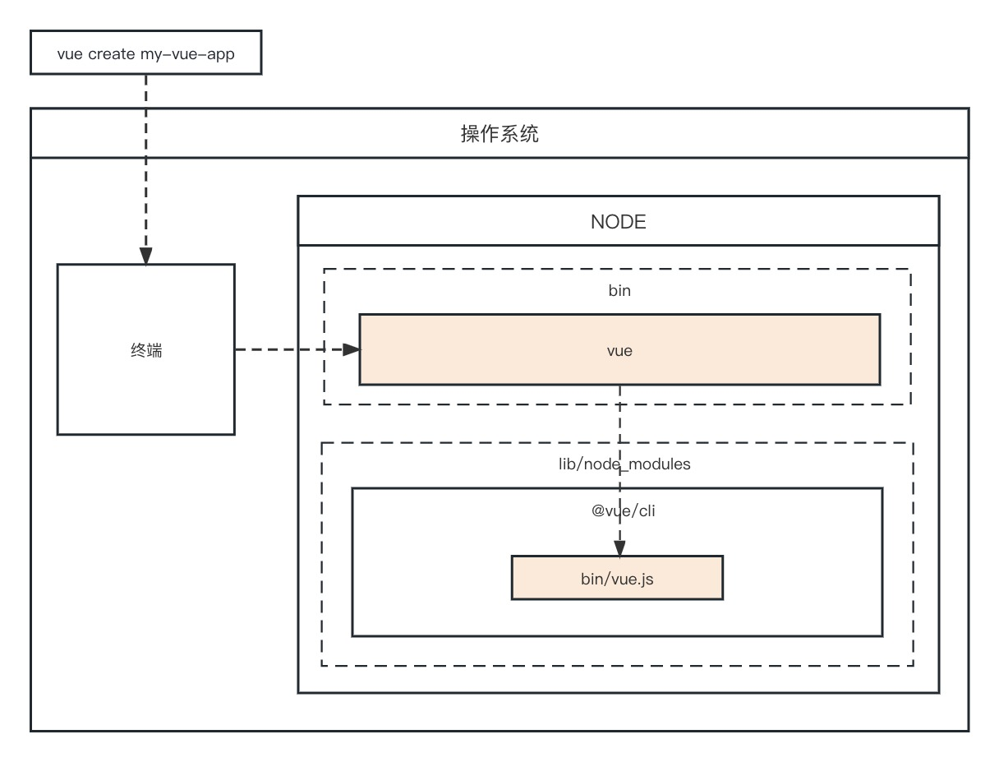

# 前端脚手架

## 研发架构图

## 脚手架执行流程

## 参考文档
由rollup打包引发的对JS模块循环引用的思考
https://juejin.cn/post/6862635764981235719

rollup使用过程中遇到的各种问题
https://xudany.github.io/rollup/2019/08/13/rollup%E4%BD%BF%E7%94%A8%E8%BF%87%E7%A8%8B%E4%B8%AD%E9%81%87%E5%88%B0%E7%9A%84%E5%90%84%E7%A7%8D%E9%97%AE%E9%A2%98/

## 问题优化
1.package包 update函数优化
