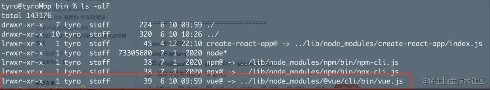
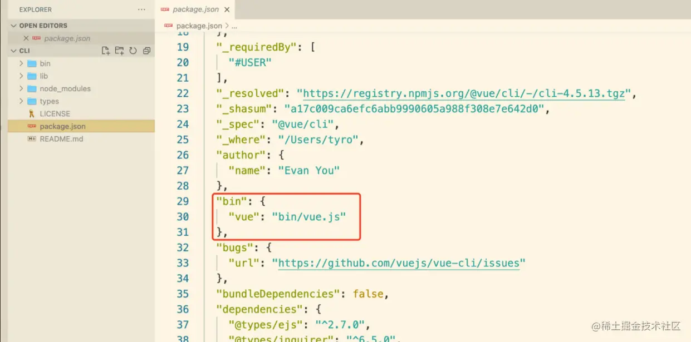
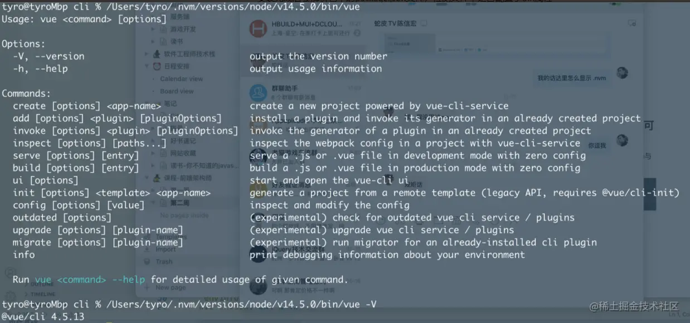
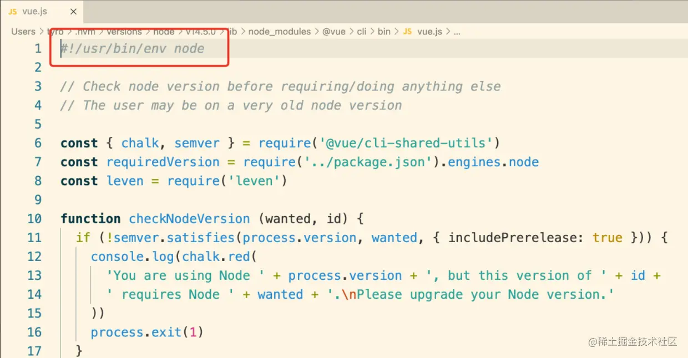

## 脚手架安装与使用

拿我们常用的脚手架vue-cli举例：

我们使用npm指令安装脚手架：npm install -g @vue/cli

输入指令使用脚手架快速搭建项目： vue create my-vue-app

简单分解一下我们在命令行中输入的指令， 将vue理解为脚手架的主命令，create 为脚手架的 command， my-vue-app为 command的参数 param。

## 执行脚手架指令之后系统做了哪些操作
1.在系统环境变量里寻找 vue 这个主命令

2.找到 vue 命令的位置后系统执行 vue 文件。这里说明一下，vue文件的类型为lrwxr

-xr-x，不清楚的大家可以百度一下，它是一个链接文件，类似于windows系统中的快捷方式，执行它实际上执行的是node/lib/node_modules/@vue/cli/bin/vue.js文件

3.执行vue.js文件，解析命令行中我们输入的 command 与 command param

4.执行 command

5.执行完毕。

## 脚手架执行原理 - 解疑

### 为什么我们安装了 @vue/clil 之后会创建 vue 命令？

在 vue-cli 安装目录里面有一个 package.json 文件，里面包含一个 bin 配置。 bin 对象的 key： vue 表示安装完成之后在系统环境变量中创建的命令名称， bin 对象的value： bin/vue.js 表示执行 vue命令之后实际执行的文件。

### 全局安装 @vue/cli 时发生了什么？

1.在 node lib/node_modules中安装 @vue/cli

2.安装完成后会解析包中的 package.json 文件，检测文件中是否配置了 bin 属性

3.若 package.json 中包含了 bin 属性，则会在node bin目录下用bin中声明的key创建一个全局指令，并链接到bin中声明的value，即生成一个链接文件vue，链接指向bin/vue.js，也可以将链接文件vue理解成 bin/vue.js的快捷方式。

### 执行vue命令时发生了什么？为什么 vue指向一个js文件，我们却可以通过vue命令去执行它？

1.执行vue命令时系统会在环境变量中找到该命令对应的文件并执行它，在命令行中执行 vue 命令与 执行 链接文件vue /Users/tyro/.nvm/versions/node/v14.5.0/bin/vue是等价的。

2.虽然vue命令指向了vue.js，但我们一般执行js文件都是通过 node vue.js这样去执行。这里省略了node， vue.js为什么同样会被执行呢？答案是 vue.js 中的第一行代码起到了作用： #!/usr/bin/env node 。执行这行代码会让系统去环境变量中找到node并执行它，最终的结果就等价于执行了 node vue.js。

