## 快速搭建一个脚手架

使用 npm init 初始化项目，在 package.json文件中添加 bin 配置，我们设置脚手架的脚本命令名称为 tyro-cli，命令实际执行的文件为 bin/index.js 。

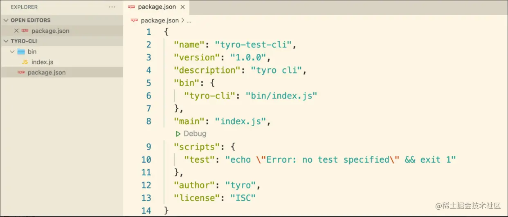

创建脚手架入口文件 bin/index.js， 并在第一行添加 #!/usr/bin/env node

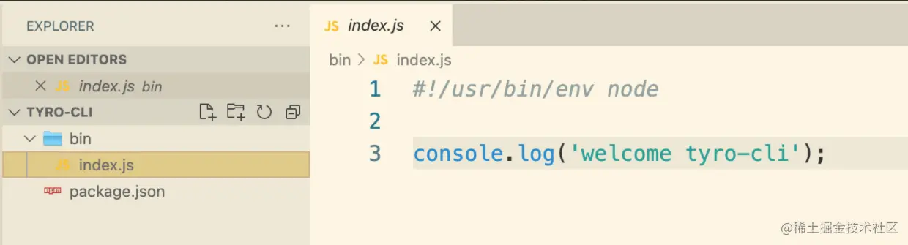

使用 npm login 与 npm publish 发布脚手架

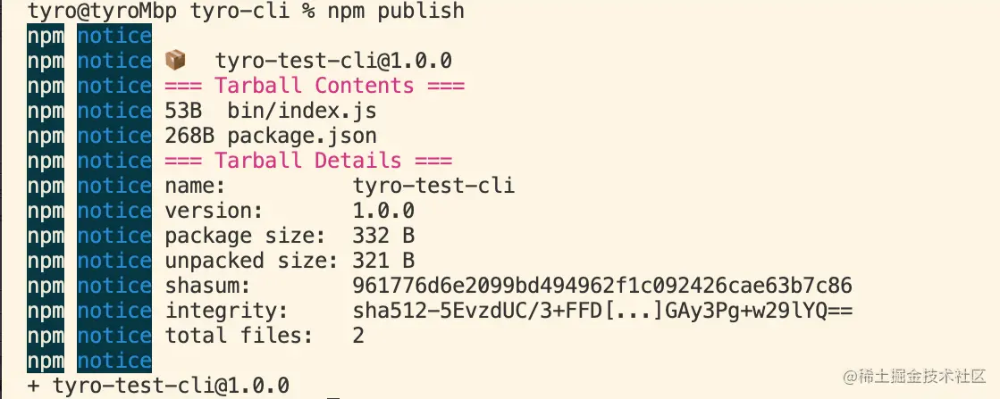

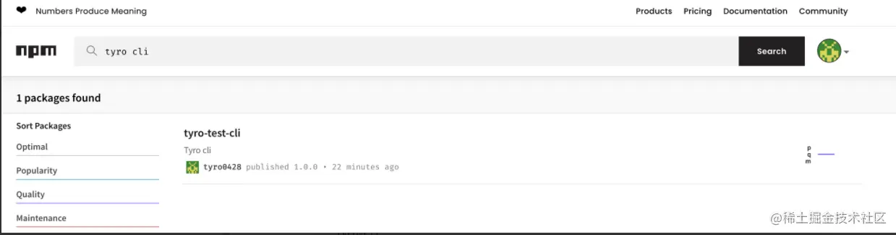

发布成功后全局安装脚手架并执行我们定义的脚手架指令

npm install -g tyro-test-cli

tyro-cli

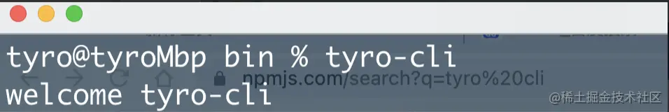

运行成功，脚手架开发完成！ ：）

## 脚手架的本地开发调试

现在我们成功发布了一个极简的脚手架到npm仓库。后续进入正式开发阶段，这个阶段脚手架的调试该怎么做呢？是不是需要 编写完代码 -> 重新发布 -> npm -> npm install -g 重新安装 -> 命令行运行指令？ 然后反复进行这套流程呢？

答案当然不是，脚手架本地开发调试有两种方式。前面我们已经了解了脚手架命令其实是链接到了某个具体的执行文件，我们这里tyro-cli命令链接指向的是 bin/index.js。所以第一种本地运行调试的方法是在本地包目录下直接执行 bin/index.js :

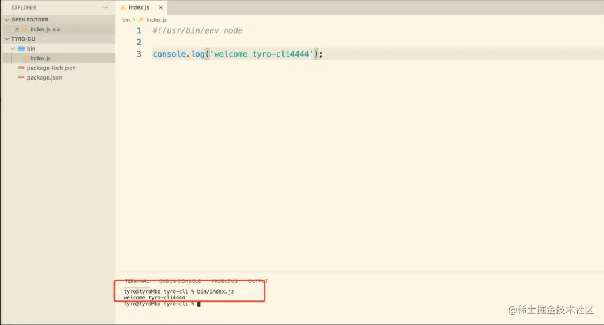

第二种方法是我们在开发阶段无需通过npm进行全局安装， 在本地脚手架目录下执行 npm link 即可在环境变量中创建一个命令指向当前本地项目中的 bin/index.js。接下来我们可以在任何位置执行命令 tyro-cli 进行运行调试。开发完成后在脚手架目录下执行 npm unlink即可删除环境变量中的链接文件，取消与本地脚手架仓库的关联。

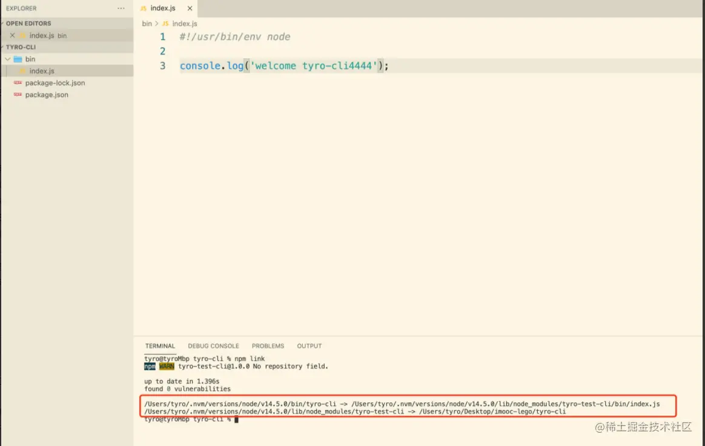

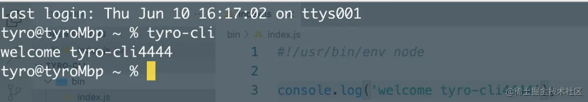

## 脚手架的本地分包开发

如果我们的脚手架需要进行分包开发，如何在一个包中引入其他本地包呢？举个例子，我们现在需要引入tyro-cli-lib模块

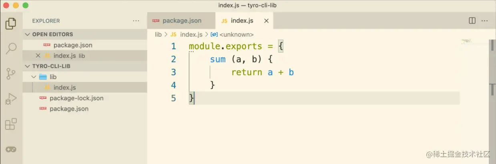

在 tyro-cli-lib 目录下执行 npm link，npm会在 全局 node lib/node_modules目录下创建一个包并指向我们本地的tyro-cli-lib包

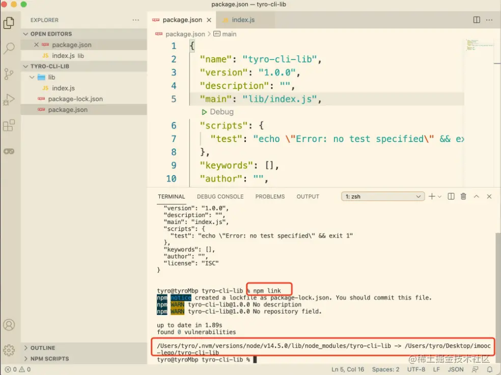

在 tyro-cli 中 执行 npm link tyro-cli-lib 指令即可，但要注意一点，tyro-cli 项目中的package.json文件并没有自动添加对 tyro-cli-lib的依赖。

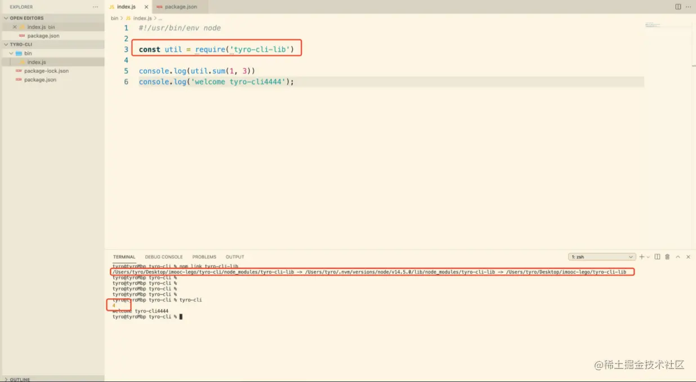

为了避免项目上线前我们忘了给tyro-cli添加对tyro-cli-lib包的依赖，我们需要在 package.json 文件中手动添加对分包的依赖。

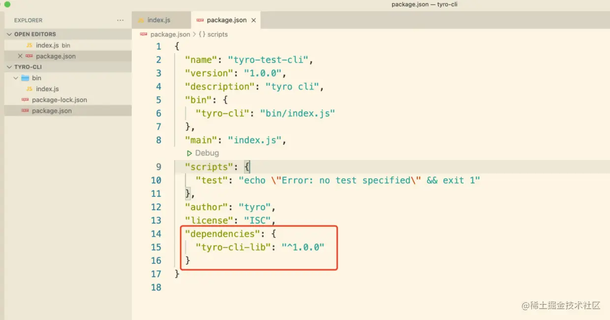

## 解除本地依赖

脚手架开发完毕后，需要在 tyro-cli 目录下执行 npm unlink tyro-cli-lib 解除对本地模块的关联。在 tyro-cli-lib目录下执行 npm unlink 删除全局node lib/node_modules 与本地 tyro-cli-lib的关联。

## 最后
写到这里，对脚手架的开发流程做了大体上的介绍，后续会继续与大家分享脚手架开发的具体细节。
