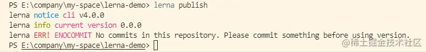
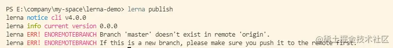
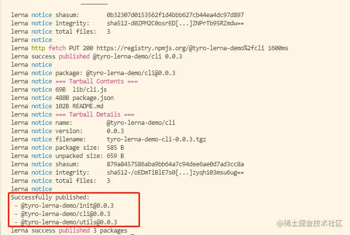

## lerna的作用
分包开发的过程中我们会面临以下一些问题：

- 创建每个包我们都需要添加package.json文件和入口文件，这是一个重复性的工作！

- 后期对每个包进行更新迭代时，我们从远程仓库clone下脚手架项目后，需要切换到每个包下执行npm install去安装每个包所依赖的npm 模块，这是一个重复性的工作！

- 脚手架开发完成后，我们需要将每个包发布到npm仓库。我们同样需要切换到每个包下修改包的版本号，执行npm publish。这是一个重复性的工作！

可能还有一些问题上面没有列出来，但我们会发现这些问题的共同点就是重复性操作！那么我们就急需一个包管理工具来解决这些问题。
它就是今天我要向大家介绍的包管理工具：lerna。 

## lerna的使用 

完整的lerna api 大家可以访问 [lerna仓库](https://github.com/lerna/lerna) 学习。这里带大家快速上手lerna 

## 安装lerna

    mkdir lerna-demo
    cd lerna-demo
    npm init -y
    npm install -S lerna

## 对脚手架进行lerna初始化

    lerna init

执行完后我们脚手架项目的目录结构如下图所示，项目中多出来一个packages目录与lerna.json文件。

我们需要重点关注点就是lerna.json文件，packages属性中 "packages/*" 表示 packages目录下的所有包都受lerna管理。这里的包指的是packages下的包而不是packages本身，这点大家需要注意。也就是说packages这个目录本身没有什么意义，我们可以随意修改。

假设我们的脚手架分三大部分：

- 核心包存放在core目录
- 所有命令包存放在commands目录
- 所有工具包放在utils目录

现在对lerna.json文件以及项目目录结构进行修改：

## 通过lerna创建包

完成脚手架基本目录结构的搭建，我们正式进入脚手架的开发。

在core目录下创建cli包负责脚手架的基本业务逻辑；

在commands目录下创建init包负责脚手架执行init命令时的业务逻辑；

在utils目录下创建utils包负责常用工具函数的编写。

通过lerna提供的create指令快速创建 cli、init、utils 包。这里需要注意两点：

- 执行lerna create cli core指令时，cli表示要创建的包名为cli，core表示包创建在core目录下。这里的core必须在lerna.json的packages中有过配置。

- 执行lerna craete cli core指令后，需要填写 package name。这里的package name指的是发布到npm仓库的包名。起初我这边输入的是 @lerna-demo/cli,但@lerna-demo这个packages前缀在npm仓库已存在，所以修改成了@tyro-lerna-demo/cli。这里大家要注意起的包名不要在npm仓库中已存在。

## 将包发布到npm仓库

通过 lerna publish 将 cli、init、utils三个包发布到npm仓库 

执行lerna publish指令后控制台提示我们的仓库没有发生任何提交变动，我们对本地仓库执行git commit之后再次执行lerna publish

控制台错误信息提示当前仓库没有关联远程仓库，我们在github或其码云之类的托管平台创建远程仓库并与当前本地仓库进行关联，再次执行lerna publish。

这次没有报错，lerna提示我们选择一个发布的版本号，这里我们选择0.0.1即可。在实际开发中大家根据需要选择对应的版本号。

选择完版本号之后这次控制台又出现了新的错误，百度一下错误信息发现：当我们的包名包含@前缀时，这个包需要是一个公有包。解决方法是在每个包的package.json文件中添加以下内容：

    // commands/init package.json
    // core/cli package.json
    // utils/utils package.json

    "publishConfig": {
        "access": "public"
    }

重新发布，再次报错。这次错误提示我们没有在npm仓库中创建对应的@tyro-lerna-demo package。这里我们先去npm创建package再来执行lerna publish

经历过一次又一次的失败，我们终于成功通过lerna将包发布到npm仓库上拉！

## 补充

- 我们每次执行lerna publish后不管是否发布成功，每个包的版本号都会发生变化。就像我们上面那个demo，最开始的版本是0.0.0，结果经历各种失败之后版本变成了0.0.3.如果大家希望最后发布到npm的版本号是0.0.1，我们需要手动将项目中每个包的package.json中的version修改为0.0.0，,还需要将远程仓库中新增的标签删掉，否则我们在执行lerna publish时会提示当前版本已存在。

- lerna为我们提供了 lerna bootstrap命令安装所有包的依赖，相当于我们切换到每个包下执行npm install命令安装依赖。
