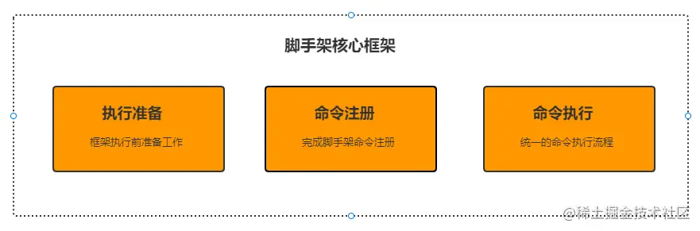
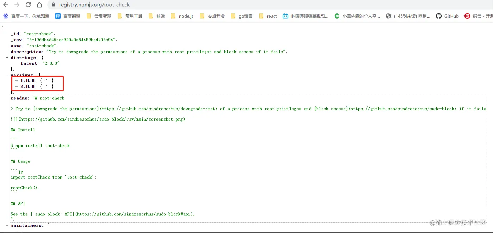
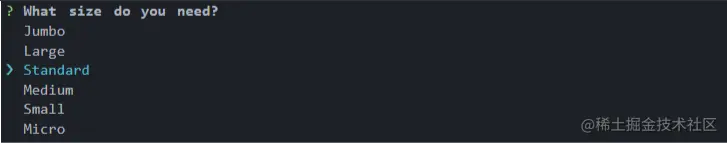

## 架构设计

## 执行准备

### 检查node版本

若脚手架所依赖的库对node版本有要求，我们需要对当前用户环境的node版本进行检查

    const semver = require('semver') // 版本号处理库，包含版本号比较，格式化等功能
    const colors = require('colors/safe') // 命令行输出颜色处理
    const LOWEST_NODE_VERSION = '12.0.0' // 定义最低node版本

    let currentVersion = process.version
    let lowestVersion = LOWEST_NODE_VERSION
    if (!semver.gte(currentVersion, lowestVersion)) {
            throw new Error(colors.red(`脚手架 需要安装 v${lowestVersion} 以上版本的 node.js`))
    }

### root权限降级

避免脚手架开发者使用root权限进行文件操作，导致其他协作开发者无法对文件进行修改

    // root-check 尝试降级具有root权限的进程的权限，如果失败，则阻止访问
    const rootCheck = require('root-check')
    rootCheck()

### 检查脚手架版本

获取当前脚手架版本与npm上的版本信息并进行比较，若当前版本低于npm上的版本，输出警告信息，提示用户手动更新脚手架。

- 脚手架当前版本通过 package.json文件中的 version 获取
- npm上的版本信息通过axios请求接口（ registry.npmjs.org/ + 包名）获取，如：

### 命令注册

命令注册通过 commander 包实现，文档请移步commander使用文档, 这里给出官网提供的命令注册栗子：

    const { program } = require('commander');

    program
    .command('clone <source> [destination]') // 注册clone命令
    .action((source, destination) => {
            // action回调中编写 命令执行 逻辑
        console.log('clone command called');
    });

### 命令执行

在action回调中编写命令执行代码，若当前命令需要提供命令行交互，如我们执行 vue create myProject后，命令行出现 vue版本选择等一系列交互流程，可使用 inquirer 库来实现，请移步 inquirer使用文档来学习，这里给出官网提供的例子：

    var inquirer = require('inquirer');
    inquirer
    .prompt([
        type: 'list',
            name: 'size',
            message: 'What size do you need',
            choices: [
                {value: '0', name: 'Jumbo'},
                {value: '1', name: 'Large'},
                {value: '2', name: 'Standard'},
                {value: '3', name: 'Medium'},
                {value: '4', name: 'Small'},
                {value: '5', name: 'Micro'},
            ]
    ])
    .then((answers) => {
        // answers.value 为用户选择的size value
    })

